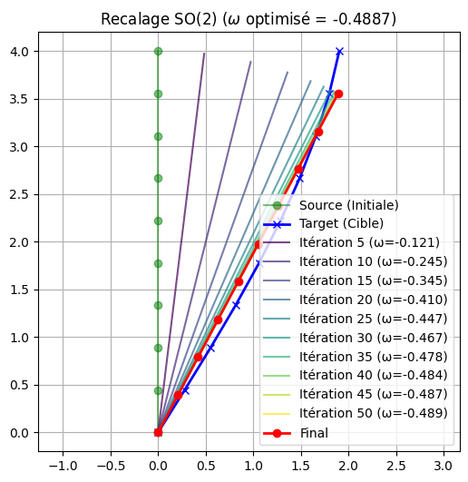

# Étude du groupe de Lie $SO(n)$ dans le cadre de l’analyse de formes

[](https://opensource.org/licenses/MIT)

## Description

Ce dépôt contient le travail réalisé durant un stage de recherche portant sur l'étude du groupe de Lie $SO(n)$ appliquée à l'analyse de formes. L'objectif est d'explorer les propriétés géométriques et algébriques de $SO(n)$ et de faire un *modèle de recalage* rigide sur les rotations.

## Résultats

Voici un exemple d'application du modèle sur le recalage d'une forme de coq en dimension 2 (rotation optimale entre une source et une cible) :

<p align="center">
  
</p>

## Architecture du projet

```
└── 📁 Etude_du_groupe_de_Lie_SO_dans_le_cadre_de_l-analyse_de_formes
    ├── 📁 Code
    │   ├── extract_contour.py          # Script d'extraction des contours à partir d'images
    │   ├── recalage_Euler_SO2.ipynb    # Notebook pour la méthode directe
    │   └── recalage_Hamilton_SO2.ipynb # Notebook pour la formulation Hamiltonienne
    ├── 📁 Images                       # Figures et résultats Matplotlib
    ├── 📁 Rapport
    │   ├── Rapport.pdf                 # Le rapport de stage final au format PDF
    │   ├── Rapport.tex                 # Code source principal LaTeX
    │   └── ...                         # Fichiers sources LaTeX (packages, bibliographie)
    ├── LICENSE                         # Licence (MIT)
    └── README.md
```

## Contact

Auteur / Stagiaire: Antonin Lecocq

Encadrant: Rayane Mouhli
